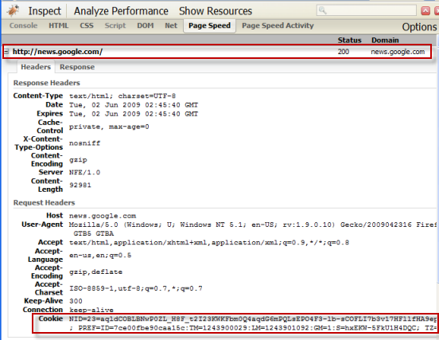
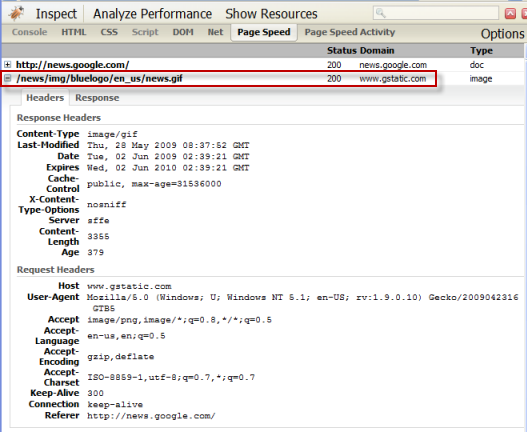

原文: https://developers.google.com/speed/docs/best-practices/request

# リクエストオーバーヘッドを最小化する

Every time a client sends an HTTP request, it has to send all associated cookies that have been set for that domain and path along with it. Most users have asymmetric Internet connections: upload-to-download bandwidth ratios are commonly in the range of 1:4 to 1:20. This means that a 500-byte HTTP header request could take the equivalent time to upload as 10 KB of HTTP response data takes to download. The factor is actually even higher because HTTP request headers are sent uncompressed. In other words, for requests for small objects (say, less than 10 KB, the typical size of a compressed image), the data sent in a request header can account for the majority of the response time.

The latency can be higher at the beginning of a new browser session. To minimize net congestion, TCP employs the "slow start" algorithm for new connections. This limits the amount of data that can be sent by the initiator of the connection before the data must be acknowledged by the recipient. If the initiator sends more than that amount of data over a new connection, an additional RTT is incurred. 

The best way to cut down on client request time is to reduce the number of bytes uploaded as request header data.

+ [リクエストサイズを最小化する](#リクエストサイズを最小化する)
+ [静的コンテンツはクッキーレスドメインから提供する](#静的コンテンツはクッキーレスドメインから提供する)

## リクエストサイズを最小化する

### 概要

Keeping cookies and request headers as small as possible ensures that an HTTP request can fit into a single packet.

### 詳細

Ideally, an HTTP request should not go beyond 1 packet. The most widely used networks limit packets to approximately 1500 bytes, so if you can constrain each request to fewer than 1500 bytes, you can reduce the overhead of the request stream. HTTP request headers include:

Cookies: For resources that must be sent with cookies, keep the cookie sizes to a bare minimum.  To keep the request size within this limit, no one cookie served off any domain should be more than 1000 bytes. We recommend that the average size of cookies served off any domain be less than 400 bytes.
Browser-set fields: Many of the header fields are automatically set by the user agent, so you have no control over them. 
Requested resource URL (GET and Host fields). URLs with multiple parameters can run into the thousands of bytes. Try to limit URL lengths to a few hundred bytes at most.
Referrer URL.

### 推奨

Use server-side storage for most of the cookie payload.
Store only a unique identifier in the cookie, and key the ID to data stored at the server end. You can use server-side cookies for both session and persistent cookies by specifying the expiry date/time on the cookie.
Remove unused or duplicated cookie fields.
The fields set by a cookie at the top-level path of a domain (i.e. /) are inherited by the resources served off all paths below that domain. Therefore, if you are serving different applications on different URL paths, and you have a field that applies globally to all applications on a domain — for example, a user's language preference — include that field in the cookie set at the top-level domain; don't duplicate the field in cookies set for subpaths. Conversely, if a field only applies to an application served from a subpath — for example, a UI setting — don't include that field in the top-level cookie and force the unused data to be passed needlessly for other applications.

## 静的コンテンツはクッキーレスドメインから提供する

### 概要

静的リソースをクッキーレスドメインから提供することで、ページで生成されるリクエストの合計サイズを削減することができる。

### 詳細

画像や、JS、CSSのような静的なコンテンツは、ユーザーとのインタラクションが無いためクッキーを付帯させる必要がない。そのためクッキーを送信しないドメインから静的リソースを提供することでリクエストレイテンシーを減少させることができる。このテクニックはとりわけ、めったにアクセスしない画像アーカイブページや、頻繁にサムネイル画像に変更があるようなキャッシュしにくいコンテンツをたくさん読み込んでいるページに対して有効です。静的リソースが5つ以上あるようなページならどのページでもこのテクニックを推奨する。（これよりも少ないリソースのページに関しては、新たにドメイン設定する手間をかけるほどでもない。）

静的コンテンツを提供するためにクッキーレスドメインを予約するには、新しいドメイン名を登録し、既存のドメインのAレコードに対して新しいドメインのCNAMEレコードをDNSデータベースで設定する。新ドメインから静的リソースを提供するためにWebサーバーをセットアップし、このドメインではいかなる場所でもクッキーを送信しないようにする。Webページにおいては静的リソースの参照はドメイン名付きのURLで参照する。

If you host your static files using a CDN, your CDN may support serving these resources from another domain. Contact your CDN to find out.

静的ファイルをCDNでホスティングしている場合、そのCDNは他のドメインからこれらのリソースを提供することをサポートしているだろうから直接CDNに問い合わせてみる。

### 推奨

__プロキシーキャッシュを有効にする__  
めったに変更しないリソースのために、ブラウザ、プロキシーサーバー向けにキャッシュヘッダーを設定する。これらのリソースにはクッキーが送信されないため、プロキシーキャッシュがユーザー特定のコンテンツをキャッシュするという危険性がないからだ。

__クッキーレスドメインから読み込まれた外部JSファイルを初期段階で提供しない__  
ドキュメントヘッドで参照されページのスタートアップに必要とされるJavaScriptは、それらはメインドキュメントと同じホスト名から提供されるべきだ。なぜなら、多くのブラウザはJavaScriptファイルが完全にダウンロード、パース、実行されるまで他のリソースのダウンロード、レンダリングを止めるため、この処理にさらにDNSルックアップを追加してしまう危険性が避けるためだ。

### 事例

Many Google properties, including News and Code (this site), serve static resources, such as JS files and images, from a separate domain, www.gstatic.com. No cookies can be set on this domain. For the News homepage at news.google.com, you can see the cookie in the request header in this screen shot:

Google NewsとGoogle Code(このサイト)も含めて多くのGoogleサイトでは、JSファイルや画像のような静的リソースをドメインを分けた`www.gstatic.com`から提供している。このドメイン上ではクッキーをセットすることが出来ません。メインのドキュメントページのために`news.google.com`のドメイン上ではスクリーンショットのヘッダーでクッキーが送信されていることを確認できるだろう。

しかし、Newsのロゴ.gifを提供している`www.gstatic.com`では、ヘッダーにクッキーがないことが分かる。

